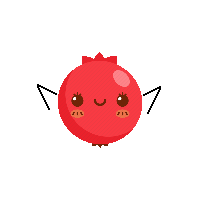
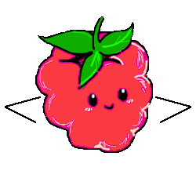

# PomBerry

PomBerry was inspired by an iOS game called FlappyBird. We wanted a more personal experience for our users so we tailored it especially for our 6.1 iOS day class ! 

PomBerry integrates the traditional FlappyBird game consisting of 2-D graphics, with upgraded sound and visual features for  a more dynamic gameplay.

# Outline

This game is adapted from "Flappy Bird", in which the player taps the screen to move the player’s character, the two fruits of your choice, to flap its 'wings' and move upwards and forwards. The player must navigate the character through a series of openings between XCodes Errors pillars. Colliding with or getting near a pilar results in a game over. The player will be awarded one point for each set of pilars successfully passed. The two fruits characters are:

- Pomegranate 
- Raspberry 

## Home Screen

## Character Selection Screen

## Game Play Screen

# Authors

- **Jack Wong** - Tech Lead
- **Eric Widjaja** - Tech Lead
- **Krystal Campbell** - Project Lead
- **Alyson Abril** - Design Lead

# Overview

Looking to pass time during your five minute breaks during lecture, play PomBerry.

Do you need a Rubber Duck Debugging Session, but dont have your duck with you, well you're in luck! Play Pomberry, and listen to Davids words of affirmations to help you get back on track!

Feeling stuck on wording your proposal or your job applications, play Pomberry.
